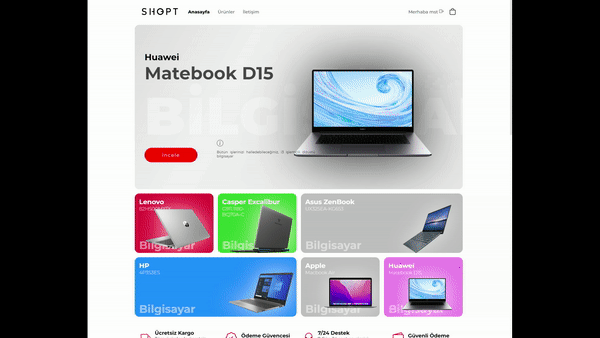
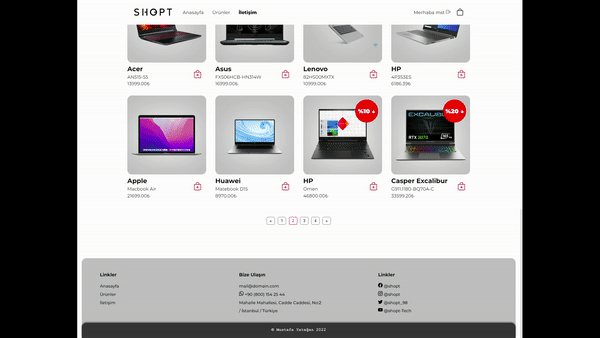
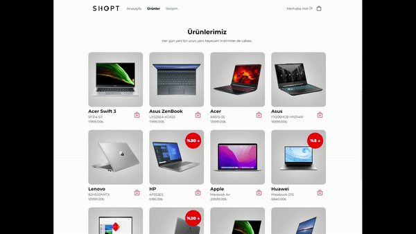

# SHOPT Front-End Projesi


*Shopt a front-end project*

Bir mağaza uygulaması. Tabiki fake. Kullanıcı bilgileri localstorage'da tutuluyor. Yalnızca bir front-end uygulaması olmasından ziyade back-end'i de kendi içerisinde bulunduruyor. Ekstra olarak kullanıcı bilgileri local storage'e yazılmadan önce base64 encde ediliyor.

*A shop web application. Ofcourse it's fake. User credentials are kept in the browser's localstorage. Although it's a front-end application it alsa includes back-end process. As an extra step Shop information and uzer credentials are being encded with base64 before written on local storage.*

Bütün site observable pattern kullanıyıor. Yani, sepette, üründe ya da kullnıcıda herhangi bir değişiklik olduğunda register olan Observer(Gözlemci) sınıflara bildirim gidiyor. Aynı zamanda herhangi bir hata ile karşılaşıldığında, Toast Mesaj olarak Gözlemcilere mesaj gönderiliyor.

*The whole site uses the observable pattern. Means, when there is any change in the cart, product or user, the Observer classes that are registered, gets notified. Also when any error is encountered, Toast Observer and the other observers are being dotified.*

Siteyi responsible olarak düşünmedim. Daha çok sayfalama ve ürün gösterimi konusuna eğildim. 

```javascript
  addObserver(/**/) {
    const args = Array.prototype.slice.call(arguments)
    for (let o of args)
    {
      this.observers.push(o)
    }
    return this
  }

  addErrorObserver(/**/) {
    const args = Array.prototype.slice.call(arguments)
    for (let o of args)
    {
      if (o instanceof ElementErrorObserver) {
        this.errorObservers.push(o)
      }
    }
    return this
  }

  notifyObservers() {
    for (let o of this.observers) {
      o.update(this.userCarts.carts[this.userCarts.lastLoggedInUser])
    }
  }

  notifyErrorObservers(e) {
    if (this.debugmode)
      console.error(e)
    for (let o of this.errorObservers) {
      if (!(e instanceof ShopError))
        o.update(new ShopError(e.message))
      else
        o.update(e)
    }
  }

```

## Slider

```javascript
class Slider {
  #sliderElementQuery
  constructor(sliderElementQuery, sliderDuration = 5000, showFunc) {
    this.#sliderElementQuery = sliderElementQuery
    this.slidersElement = document.querySelector(this.#sliderElementQuery)
    this.sliderElements = undefined
    this.sliderCount = this.sliderElements?.length
    this.currentSlider = 0
    this.sliderDuration = sliderDuration
    this.timer = undefined
    this.isPaused = false
    this.#domHook(showFunc)
  }

  #startSliders() {
    this.sliderElements = document.querySelectorAll(this.#sliderElementQuery + ' .slider')
    if (this.sliderElements.length === 1)
      return
    this.timer = setInterval(() => {
      this.currentSlider = (this.currentSlider < this.sliderElements.length - 1) ? this.currentSlider + 1 : 0
      if (!this.isPaused)
      {
        this.sliderElements.forEach(sliderel => {
          const pos = (100 * this.currentSlider) 
          sliderel.style.transform = `translateX(-${pos}%)`
        })
      }
    }, this.sliderDuration)
  }


  #domHook(openDetails) {
    const parent = this.slidersElement
    parent.addEventListener('mouseover', () => {
      this.pause()
    })
    parent.addEventListener('mouseout', () => {
      this.continue()
    })
    parent.addEventListener('click', e => {
      e.stopPropagation()
      const gatheredId = e.target.getAttribute('data-id')
      if (gatheredId)
        openDetails(gatheredId)
    })
  }
  pause() {
    if (!this.isPaused)
      this.isPaused = true
  }

  continue() {
    if (this.isPaused)
      this.isPaused = false
  }

  feedSlider(sliderProducts) {
    sliderProducts.forEach(p => {
      const parent = this.slidersElement
      parent.insertAdjacentHTML('afterbegin', this.#createSlide(p))
    })
    if (this.timer) {
      delete(this.timer)
      this.currentSlider = 0
      this.sliderElements = document.querySelectorAll(this.#sliderElementQuery)
    }
    this.#startSliders()
  }

```

## Üye giriş


## Ürün Detay



## Sayfalama



## Sepet / Toast Mesayları


